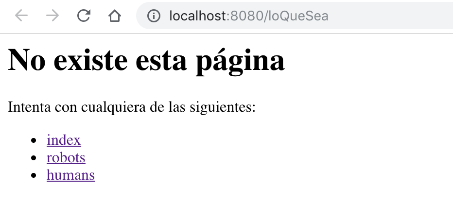
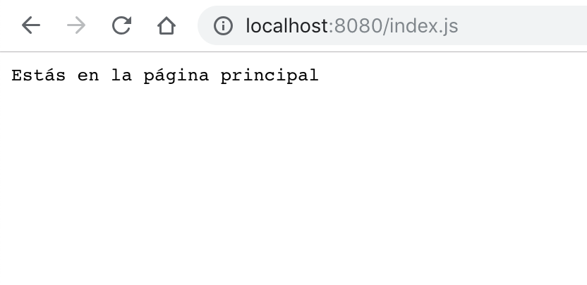
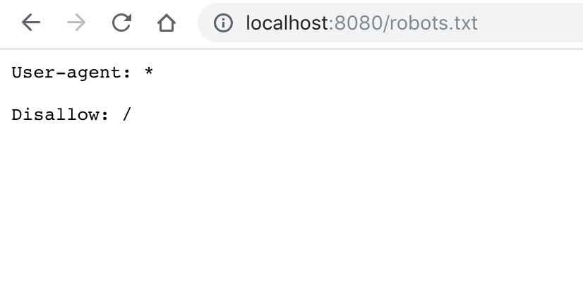
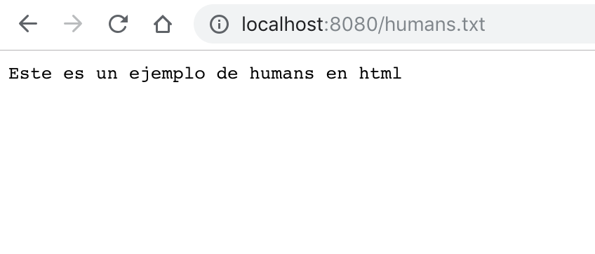

# Node Routes Sample

Este es un ejemplo simple de como servir contenido utilizando el módulo [router](https://www.npmjs.com/package/router "router - npm") de [Node.js](https://nodejs.org "Node.js"). Es un ejemplo simple.


Primero que nada hay que leer la documentación

-  [router](https://www.npmjs.com/package/router "router - npm")
-  [Node Modules](https://www.w3schools.com/nodejs/nodejs_modules.asp "Node Modules in w3schools")

Como se puede ver, no es necesario utilizar librerías _fancys_ para hacer esto, sólo se necesita saber como funciona Node.js. Hay que recordar que Node.js es un interprete de Javascript (ES6 en sus últimas versionas) que tiene una serie de librerías y utilidades nativas y core. NPM es un manejador de paquetes con el cual se puede instalar cualquier paquete público (O privado). __No hay que confundir Node con los frameworks basados en el mismo__, como [express](https://expressjs.com/ "Express.js"), [Koa](https://koajs.com/ "Koa"), [SailsJS](https://sailsjs.com/ "Sails") (En este está hecho el CMS del e-commerce), etc; tampoco confundir con Frameworks que sirven para otras cosas, como Vue, React, que jalan del lado del cliente y, aunque tiene utilerías para ser utilizados con Node y precompilados, son totalmente distintos en filosofía.

En este ejemplo se pueden ver las técnicas básicas para utilizar Router para generar urls dinámicas.

## Installation

Primero que nada asegúrate de tener instalado Node y npm, no podré aquí esas instrucciones porque ya deberías de tenerlo instalado.

La versión de Node utilizada es la 11.0.0, puedes comprobar que tengas la versión correcta con el comando:

```bash
node --version
```

Después hay que clonar éste mismo repositorio:

```bash
git clone git@github.com:Logistica-Prixz/node-routes-sample.git
```

Luego instalamos nodejs (No te preocupes, sólo tiene 1 dependencia):

```bash
npm install
```

## Usage

Para usar el ejemplo, una vez instalado, sólo hay que ejecutar el siguiente commando:

```bash
node index.js
```

Para el primer ejemplo de uso básico visitamos todas estas urls y vemos la salida en nuestra terminal:

- [http://localhost:8080/landing/metformina](http://localhost:8080/landing/metformina)
- [http://localhost:8080/landing/glucosa-alta](http://localhost:8080/landing/glucosa-alta)
- [http://localhost:8080/landing/PedirMedicamentosEnLinea](http://localhost:8080/landing/PedirMedicamentosEnLinea)
- [http://localhost:8080/landing/EsCalladaTimidaInocenteYtienelaMirada](http://localhost:8080/landing/EsCalladaTimidaInocenteYtienelaMirada)

Para el ejemplo del uso del módulo sólo tenemos que visitar: [http://localhost:8080/cualqueirUrl](http://localhost:8080/loQueSea)

Veremos algo como esto:



Si seguimos el link a index, nos llevará a la url [index.js](index.js) y podremos ver algo como lo que sigue:



Podemos regresar o tipear cualquier url que no esté en la lista para ver la pantalla anterior.

Si seguimos al link robots veremos:



Y si seguimos al link humans veremos:




### El código

Es importante leer los comentarios en el código del archivo [index.js](index.js) primero. También recomiendo leer el historial de commits, esto se hace ejecutando el siguiente comando:

```bash
git log --graph --all
```
Básicamente, lo que hay que tomar en cuenta es las líneas donde aparece el router que se importa hasta arriba.

Aquí podemos ver como crear un Router y manejar cualquier error en caso de que exista.

```Javascript
var Router = require('router')

// Crea la ruta y el servidor
var router = new Router()
// Aquí se crea el servidor
var server = http.createServer(function onRequest(req, res) {
  router(req, res, err=>{
    console.log(err)
  })
})
```

Para reigstrar una ruta se utiliza el método ```router.route(ruta)``` pasándole como parámetro la ruta que queremos registrar. Se pueden utilizar comodines, hay varias maneras, pero en este ejemplo nos enfocaremos en la más utilizada que es poner dos puntos y el nombre de la variable que queremos definir para tratar así la url.

### Ejemplo

Si definimos ```router.route('inicio')``` todas las llamadas hechas a localhost:8080/inicio serán tratadas por esta ruta. Luego hay que definir el método, si no importa el método usamos la función all.

Es importante enteder que la función route nos devuelve (de nuevo) el router en cuestión, pero ya con la ruta fijada, por eso podemos llamar las funciones all, get, post y demás desde ahí, estas mismas también devuelven el mismo objeto, por eso podemos encadenar las funciones.

```Javascript
router.route('/landing/:id')
  .get(function (req, res) {
    console.log('GET')
  })
  .post(function (req, res) {
    console.log('POST')
  })
  .all(function (req,res){
    console.log('ALL')
  })
```
En este ejemplo, para obtener la variable id que indicamos en la ruta, es decir cualquier palabra que siga. localhost:8080/landing/soyunagorditaamigajonadita sería la variable *id=soyunagorditaamigajonadita*

Por último, también agregué un ejemplo de como hacer esto utilizando módulos, en este ejemplo cree un archivo llamado [manejador.js](manejador.js) en el que creo un módulo que tiene una función ```filtrar(req,res)``` que recibe el request y el response (Vacío obvio, porque no lo ha enviado aún)

Ya no comenté ese código, pero creo que queda claro :trollface:

Espero que sea de ayuda :nerd_face:


## Contributing
Si quieres ampliar esta documentación crea un branch y agrega lo que quieras, luego haz un pullrequest (:point_up: Es grosero agregar algo a master sin avisar, mejor hacer pull request)

## License
No tiene licencia este ejemplo
